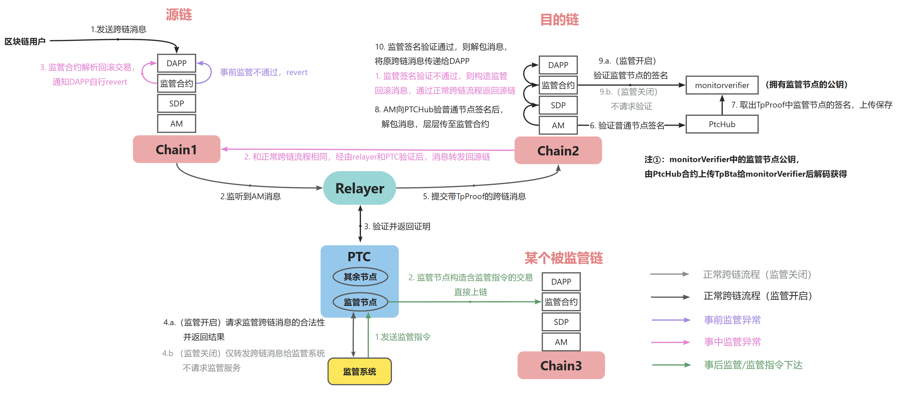
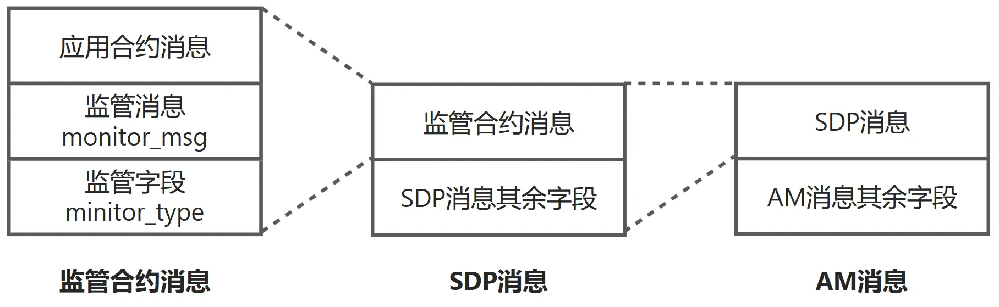
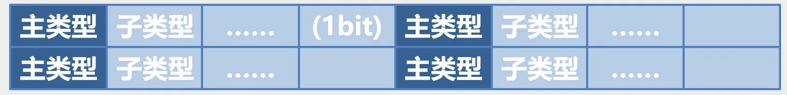

# 本分支新增功能总结

## 基本说明

本仓库基于[AntChainOpenLabs
AntChainBridge](https://github.com/AntChainOpenLabs/AntChainBridge)仓库开发，加入了跨链监管功能，完成了如下内容：
- **监管节点的开发**：完成了与课题四监管系统对接所需的v1版接口，以便提供跨链消息内容和接收监管指令。

- **部分区块链对监管的支持**：修改了ethereum插件，加入了监管协议，支持事前、事中以及事后（接收监管指令并存储）监管；支持对AntChainBridge中有序和无序消息的监管；**需要注意的是，目前仅支持SDPv1版本的消息。**

具体部署和对接使用的监管设计文档，请详见项目的语雀知识库。


## 含监管的流程图示
- 下图为含监管的跨链流程图：




## 其他说明

### 跨链消息结构设计变更说明
监管合约作为SDP上层合约，封装DApp消息的同时增加监管字段monitor_type和监管信息monitor_msg。SDP和AM合约的消息字段详见 [Wiki](https://github.com/AntChainOpenLabs/AntChainBridge/wiki/%E5%8C%BA%E5%9D%97%E9%93%BE%E6%A1%A5%E6%8E%A5%E7%BB%84%E4%BB%B6%E5%BC%80%E5%8F%91%E6%89%8B%E5%86%8C-V1#31-%E5%90%88%E7%BA%A6%E5%8E%9F%E7%90%86%E4%BB%8B%E7%BB%8D)。



| monitor_type值(uint32类型) | monitor_type含义                                             | monitor_msg含义(string类型) |
| ---------------------- | ------------------------------------------------------------ | --------------------------- |
| 1                      | 发送方发出的不要求监管的跨链消息                             | 可选                        |
| 2                      | 对于发送方：发出要求监管的跨链消息。对于接收方：成功接收到带监管的跨链消息 | 可选                        |
| 3                      | 监管未通过，回滚到发送方的监管回滚消息                       | 可选，如监管未通过的原因    |


### 背书策略配置说明
为加入antchain的区块链配置背书策略时，监管节点需要设置为true，举例说明如下。
- 当监管开启时，监管节点会向监管系统请求跨链消息的合法性，**合法则返回一个正确签名，不合法则返回一个空签名**。
- 当监管关闭时，监管节点的运行逻辑和其他节点完全相同，只是不会在链上合约进行签名验证。
```
{
    "committee_id": "default",
    "endorsers": [
        {
            "node_id": "node1",
            "node_public_key": {
                "key_id": "default",
                "public_key": ""
            },
            "required": true
        },
        {
            "node_id": "monitor-node",
            "node_public_key": {
                "key_id": "default",
                "public_key": ""
            },
            "required": true
        }
    ],
    "policy": {
        "threshold": ">=0"
    }
}
```


### 监管指令结构说明
acb-committeeptc/monitor-node/src/main/proto/monitorSystemgrpc.proto中的监管指令结构如下：
```
message MonitorOrder {
  string product = 1;
  string domain = 2;
  uint64 monitorOrderType = 3;
  string senderDomain = 4;
  string fromAddress = 5;
  string receiverDomain = 6;
  string toAddress = 7;
  string transactionContent = 8;
  string extra = 9;
}
```
监管节点会解析出监管指令各字段，并构造包含监管指令的交易发送到指定区块链的监管合约，最终由监管合约更新监管规则。该结构各字段含义如下：
- product
  - 监管指令要下发到的区块链的类型，例如etherum2，fiscobcos等
- domain
  - 监管指令要下发到的区块链的域名
- monitorOrderType
  - 监管指令的类型。该字段长度为32bit，采用了分层编码的设计方式（如下图），分为主类型和子类型，每种主类型标识一种监管维度，每种主类型下分多种子类型
  - 在当前设计中，每个主类型占1bit，每个子类型占3bit，即每种主类型共有8种子类型
  - 主类型的具体含义由监管系统定义。以“黑名单”作为主类型来举例，该主类型的子类型可以包含：
    - 禁止本区块链的应用合约a发送跨链交易；
    - 禁止本区块链向区块链B的应用合约b发送跨链交易；
    - 禁止本区块链向区块链B发送跨链交易等。



- senderDomain
  - 跨链过程中源区块链域名，处理方式随monitorOrderType含义而变化
  - 例如监管指令是“禁止某区块链域名发送跨链消息”，则监管合约会把senderDomain加入黑名单，最终效果为该区块链无法在跨链系统发送跨链消息。
- fromAddress
  - 跨链过程中源区块链的应用合约地址，处理方式随monitorOrderType含义而变化
  - 例如监管指令是“禁止某区块链的某应用合约发送跨链消息”，则监管合约会把fromAddress加入黑名单，最终效果为区块链的该应用合约无法在该跨链系统发送跨链消息。
- receiverDomain
  - 跨链过程中目的区块链域名，处理方式随monitorOrderType含义而变化
- toAddress
  - 跨链过程中目的区块链的应用合约地址，处理方式随monitorOrderType含义而变化。
- transactionContent
  - 针对可能要对跨链过程中的原始跨链消息内容本身进行审查而设计了该字段，用于在链上审查跨链消息内容的合规性。
- extra
  - 额外信息。用于存放监管系统希望在链上存储的一些监管指令描述，或者上述字段未充分考虑的情况等，也可为空。

目前监管合约中对监管指令的支持，只完成了**合约黑名单**和**控制监管开关**两种功能。
- 合约黑名单功能对应的监管指令，用二进制表示如下：
  - **1000** 0000 0000 0000 0000 0000 0000 0000
  - 即32bit中第一对4bit组表示“黑名单”及其子类型。子类型"000"表示加入黑名单，"001"表示移除出黑名单。
- 控制监管开关的监管指令，用二进制表示如下：
  -  0000 **1000** 0000 0000 0000 0000 0000 0000
  -  即32bit中第二对4bit组表示“监管控制”及其子类型。子类型"000"表示关闭监管，"001"表示开启监管。


## 注意事项
**如果需要对一条链chain-B下达监管指令，该链必须先接收一条跨链消息。** 因为按照系统设计，如果chain-A没有接收过跨链消息，链上合约上就不会存储tpbta这个信息，从而无法获取监管节点公钥，无法完成监管指令的签名验证，导致无法成功接收监管指令。